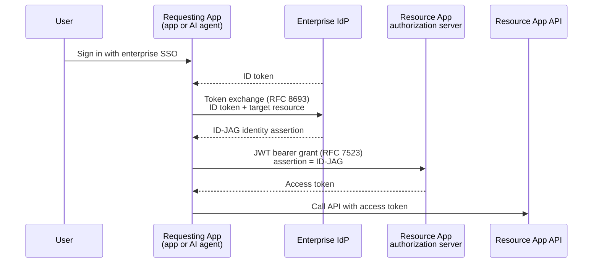

# Awesome Cross-App Access 

> A curated list of resources for Cross-App Access (XAA) and the Identity Assertion JWT Authorization Grant (ID-JAG).

Cross-App Access is an OAuth extension that lets an enterprise identity provider govern app-to-app API access. Instead of every user clicking through a per-app OAuth consent screen, the IdP issues a signed identity assertion (the ID-JAG) that a requesting app redeems at the resource app's authorization server for an access token. Admins configure the connection once, users get access on first login, and every grant is centrally policed, scoped, and logged.

It matters most for AI agents and MCP: an agent inherits exactly the access its signed-in user already has, with short-lived tokens instead of long-lived API keys.

## Contents

- [How it works](#how-it-works)
- [Terminology](#terminology)
- [Specifications](#specifications)
- [Related standards](#related-standards)
- [MCP and AI agents](#mcp-and-ai-agents)
- [Issuers](#issuers)
- [Validators](#validators)
- [Resource apps and MCP servers](#resource-apps-and-mcp-servers)
- [Libraries](#libraries)
- [Sample apps and demos](#sample-apps-and-demos)
- [Sandboxes and debugging tools](#sandboxes-and-debugging-tools)
- [Articles](#articles)
- [Talks and podcasts](#talks-and-podcasts)
- [Community](#community)

## How it works

## Terminology

| Term              | Meaning                                                                                              |
| ----------------- | ---------------------------------------------------------------------------------------------------- |
| Requesting App    | The app or agent that wants to call another app's API on the user's behalf.                          |
| Resource App      | The app whose API is being called. Runs its own authorization server.                                |
| Identity Provider | The enterprise IdP that both apps trust for SSO, and that issues the ID-JAG.                         |
| ID-JAG            | The identity assertion JWT the IdP issues, scoped to one requesting app, one resource, and one user. |
| XAA               | Cross-App Access, the common name for deployments of this pattern.                                   |
| EMA               | Enterprise-Managed Authorization, MCP's profile of ID-JAG.                                           |

## Specifications

- [Identity Assertion JWT Authorization Grant](https://datatracker.ietf.org/doc/draft-ietf-oauth-identity-assertion-authz-grant/) - The core IETF OAuth Working Group draft. Start here.
- [Latest rendered draft](https://www.ietf.org/archive/id/draft-ietf-oauth-identity-assertion-authz-grant-04.html) - HTML rendering of the most recent revision.
- [Original individual draft](https://datatracker.ietf.org/doc/draft-parecki-oauth-identity-assertion-authz-grant/) - Pre-adoption history, useful for tracing design decisions.
- [Verifiable Presentation Profile for ID-JAG](https://github.com/aaronpk/draft-parecki-oauth-id-jag-vp) - Individual draft in progress from one of the ID-JAG authors, not yet posted to the datatracker. The repo is the working area.
- [Cross-App Access on oauth.net](https://oauth.net/cross-app-access/) - Canonical overview page, maintained alongside the spec.

## Related standards

- [RFC 8693: OAuth 2.0 Token Exchange](https://datatracker.ietf.org/doc/html/rfc8693) - The exchange a requesting app performs at the IdP to obtain an ID-JAG.
- [RFC 7523: JWT Profile for OAuth 2.0 Authorization Grants](https://datatracker.ietf.org/doc/html/rfc7523) - The grant used to redeem an ID-JAG for an access token.
- [Identity and Authorization Chaining Across Domains](https://datatracker.ietf.org/doc/draft-ietf-oauth-identity-chaining/) - The broader cross-domain chaining framework that ID-JAG profiles.
- [Token Exchange explainer](https://oauth.net/2/token-exchange/) - Plain-language primer on the underlying exchange.
- [OpenID Foundation IPSIE working group](https://openid.net/wg/ipsie/) - Enterprise SSO interoperability profile work that XAA sits alongside.

## MCP and AI agents

- [MCP Enterprise-Managed Authorization](https://modelcontextprotocol.io/extensions/auth/enterprise-managed-authorization) - The MCP authorization extension built on ID-JAG.
- [modelcontextprotocol/ext-auth](https://github.com/modelcontextprotocol/ext-auth) - Source repository for the MCP authorization extensions, including EMA.
- [Enterprise-Managed Authorization: zero-touch OAuth for MCP](https://blog.modelcontextprotocol.io/posts/enterprise-managed-auth/) - The MCP project's announcement and rationale.
- [Centrally manage authorization for MCP connectors](https://claude.com/blog/enterprise-managed-auth) - Anthropic's rollout of EMA for Claude MCP connectors.
- [Authorize MCP connectors for your organization](https://support.claude.com/en/articles/15537633-authorize-mcp-connectors-for-your-entire-organization) - Admin-facing setup guide for Claude.
- [VS Code enterprise-managed MCP authentication](https://code.visualstudio.com/updates/v1_123#_enterprise-managed-mcp-authentication-preview) - EMA support in the VS Code MCP client.
- [agentgateway Cross-App Access](https://agentgateway.dev/docs/kubernetes/main/security/backend-authn-cross-app-access/) - ID-JAG as a backend authentication method in an agent gateway.

## Issuers

Every ID-JAG is minted by one party and redeemed at another, and most vendors implement only one of those sides. An issuer is the enterprise IdP: it applies the admin's access policy and mints the assertion.

- [Okta](https://developer.okta.com/docs/concepts/xaa/) - Concept docs and configuration for XAA, the first large-scale deployment.
- [Descope](https://docs.descope.com/agentic-identity-hub/enterprise-managed-authorization/issue-id-jags) - Mints ID-JAGs so the agents you run can reach third-party MCP servers and APIs, governed by policy.
- [PingFederate](https://docs.pingidentity.com/pingfederate/13.1/release_notes/pf_release_notes.html#identity-assertion-jwt-authorization-grant-id-jag) - Native ID-JAG minting, from the 13.1 release notes.
- [Keycloak](https://github.com/keycloak/keycloak/issues/48818) - Upstream tracking issue for issuing ID-JAGs.
- [Athenz](https://techblog.lycorp.co.jp/ja/20260401a) - ID-JAG in the Athenz open-source access-control system, in Japanese. The same write-up covers its validator side.

## Validators

The other half: a validator is the resource app's authorization server, verifying an assertion minted elsewhere and returning its own access token. Clients, which request the assertion in the first place, are in the MCP and AI agents section.

- [Descope](https://docs.descope.com/agentic-identity-hub/enterprise-managed-authorization/validate-id-jags) - Validates a customer's IdP assertion at the MCP server you sell, so each customer governs access with their own Okta, Entra, or Descope.
- [Auth0](https://auth0.com/docs/secure/call-apis-on-users-behalf/xaa) - Resource-app side of XAA, in early access. The enterprise IdP stays external.
- [Stytch](https://stytch.com/docs/connected-apps/guides/cross-app-access) - Exchanges an external workforce IdP's ID-JAG for a Stytch Connected Apps access token, with no browser redirect.
- [WorkOS](https://workos.com/docs/authkit/mcp) - Early access, enabled per environment. AuthKit accepts the assertion and returns a token scoped to your MCP server, with no ID-JAG code in the server itself.
- [Scalekit](https://www.scalekit.com/blog/cross-app-access-agentic-auth-flows) - Agentic auth flows built on ID-JAG.
- [Authplane](https://docs.authplane.ai/guides/xaa/) - Checks the assertion against the IdP's JWKS and mints an MCP token for policy-approved agent, scope, and resource combinations.
- [PingFederate JWT grant mapping](https://docs.pingidentity.com/pingfederate/13.1/administrators_reference_guide/help_idpconnectionconfigtasklet_oauthsamlgrantattributemappingstate.html) - Mapping an inbound assertion to a local identity.
- [Keycloak](https://github.com/keycloak/keycloak/issues/43971) - Upstream tracking issue for accepting ID-JAGs.

## Resource apps and MCP servers

Applications that let an enterprise IdP govern access to their API or MCP server.

- [Asana](https://help.asana.com/s/article/cross-app-access) - Cross-App Access for the Asana API.
- [Atlassian](https://support.atlassian.com/security-and-access-policies/docs/configuring-enterprise-managed-authentication/) - Enterprise-managed authentication across Atlassian products.
- [Canva](https://www.canva.com/help/manage-cross-app-access/) - Admin controls for Cross-App Access.
- [Datadog](https://docs.datadoghq.com/account_management/org_settings/cross_app_access/) - Org-level Cross-App Access settings.
- [Figma](https://help.figma.com/hc/en-us/articles/41992841175959-Set-up-MCP-enterprise-managed-auth-with-Okta-Cross-App-Access-XAA) - Enterprise-managed auth for the Figma MCP server.
- [Granola](https://docs.granola.ai/help-center/sharing/integrations/mcp) - MCP integration with enterprise-managed authorization.
- [Linear](https://linear.app/docs/mcp#enterprise-managed-authorization) - Enterprise-managed authorization for the Linear MCP server.
- [Notion](https://www.notion.com/help/set-up-enterprise-managed-connections-for-notion-mcp) - Enterprise-managed connections for Notion MCP.
- [Slack](https://slack.com/help/articles/54548358406419-Manage-access-to-the-Slack-MCP-server-through-your-identity-provider) - Managing Slack MCP server access through your IdP.
- [Supabase](https://supabase.com/docs/guides/platform/sso/enterprise-mcp-authentication) - Enterprise MCP authentication for Supabase projects.

## Libraries

- [doorkeeper-id_jag_grant](https://github.com/doorkeeper-gem/doorkeeper-id_jag_grant) - Validator side for Doorkeeper, the Ruby OAuth provider.
- [hmwildermuth/id-jag](https://github.com/hmwildermuth/id-jag) - TypeScript implementation of the ID-JAG specification.
- [mcpg-plugin-credential-oauth-id-jag](https://github.com/mcpg-dev/mcpg-plugin-credential-oauth-id-jag) - ID-JAG credential issuer plugin for the MCPG gateway.
- [atko-cross-app-access-sdk](https://github.com/indranilokg/atko-cross-app-access-sdk) - Community SDK for the Okta XAA flow.
- [Authplane authserver](https://github.com/AuthPlane/authserver) - Self-hosted MCP authorization server in a single Go binary, AGPL-3.0.

## Sample apps and demos

- [okta-cross-app-access-mcp](https://github.com/oktadev/okta-cross-app-access-mcp) - Reference agent and todo app showing an end-to-end XAA flow over MCP.
- [okta-js-xaa-requestor-example](https://github.com/oktadev/okta-js-xaa-requestor-example) - Minimal NestJS requesting app.
- [auth0-cross-app-access-inspector](https://github.com/auth0-samples/auth0-cross-app-access-inspector) - Node and React requesting app that shows every token in the flow.
- [id-jag-the-hard-way](https://github.com/mlajkim/id-jag-the-hard-way) - Containerized, script-free walkthrough of the tokens, policies, and trust boundaries from first principles.
- [app-service-ema-mcp](https://github.com/seligj95/app-service-ema-mcp) - Microsoft Entra and Azure App Service, separating what Entra governs today from what the EMA extension adds.
- [mcp-enterprise-managed-auth](https://github.com/starman69/mcp-enterprise-managed-auth) - Proof of concept for the EMA extension and SEP-990, IdP-driven access control over token exchange.
- [okta-cross-app-access-demo](https://github.com/indranilokg/okta-cross-app-access-demo) - Compact demo of ID-JAG tokens with MCP.
- [xaa-agent-demo](https://github.com/truefoundry/xaa-agent-demo) - A2A ReAct agent forwarding user identity through an MCP gateway.
- [xaa-playground](https://github.com/dancinnamon-okta/xaa-playground) - Playground application for learning the protocol.
- [id-jag-mcp](https://github.com/kkdai/id-jag-mcp) - Go MCP server implementing Athenz-style ID-JAG least-privilege token exchange.

## Sandboxes and debugging tools

- [XAA Guru](https://www.crossapp.guru) - Walks the flow one hop at a time against your own IdP and MCP server, showing the exact request each step sends. Works with any ID-JAG issuer, such as Okta, Ping, or Descope. Built by Descope.
- [xaa.dev](https://xaa.dev/) - Free hosted sandbox for exploring and debugging XAA flows with no setup.
- [client.xaa.rocks](https://client.xaa.rocks) - Test requesting app you can point at your own IdP.
- [motd.xaa.rocks](https://motd.xaa.rocks) - Test resource app and API for validating your ID-JAG issuance.

## Articles

- [What is Cross-App Access and how it works](https://www.descope.com/learn/post/id-jag-cross-app-access) - Thorough end-to-end explainer of the flow and its parts.
- [Enterprise-ready MCP](https://aaronparecki.com/2025/05/12/27/enterprise-ready-mcp) - The post that framed the problem XAA solves.
- [Cross-domain API access: beyond the obvious shortcuts](https://aaronparecki.com/2026/05/27/10/cross-domain-api-access) - Why the naive approaches, such as shared secrets and token passthrough, break down.
- [Integrate your enterprise AI tools with Cross-App Access](https://developer.okta.com/blog/2025/06/23/enterprise-ai) - Okta's introduction to the pattern.
- [Build secure agent-to-app connections with XAA using OIDC](https://developer.okta.com/blog/2025/09/03/cross-app-access) - Hands-on OIDC walkthrough.
- [Make secure app-to-app connections using Cross App Access](https://developer.okta.com/blog/2026/02/10/xaa-client) - Building the requesting-app side.
- [Enabling Cross App Access for SAML-based resource apps](https://developer.okta.com/blog/2026/07/03/cross-app-access-saml) - Bridging XAA into SAML-federated apps.
- [Client registration and enterprise management in the MCP authorization spec](https://aaronparecki.com/2025/11/25/1/mcp-authorization-spec-update) - How EMA landed in MCP.
- [Diving into the MCP authorization specification](https://www.descope.com/blog/post/mcp-auth-spec) - Broader tour of MCP auth with EMA in context.
- [XAA: the enterprise way to govern AI app integrations](https://workos.com/blog/id-jag-cross-app-access) - Vendor-neutral framing of the admin story.
- [Cross-App Access for AI agents, and where Keycloak stands](https://skycloak.io/blog/cross-app-access-id-jag-ai-agents-keycloak/) - Open-source IdP perspective on adoption.
- [ID-JAG deep dive](https://dev.to/kanywst/id-jag-deep-dive-1mhp) - Community walkthrough of the token structure and claims.
- [ID-JAG notes by Karl McGuinness](https://notes.karlmcguinness.com/tags/id-jag/) - Running notes from one of the spec's authors.
- [The Cross App Access protocol makes AI agents enterprise-ready](https://thenewstack.io/the-cross-app-access-protocol-makes-ai-agents-enterprise-ready/) - Industry analysis of why the pattern caught on.

## Talks and podcasts

- [One login to rule them all: Cross-App Access for MCP](https://www.youtube.com/watch?v=EmhRyw6xeT0) - Conference talk covering the motivation and the flow.
- [Putting the single back in single sign-on](https://www.youtube.com/watch?v=HRrzzORvy84) - MCP Dev Summit session on XAA and MCP.
- [The grant behind Enterprise-Managed Auth for Claude](https://www.insecureagents.com/episodes/karl-mcguinness/) - Insecure Agents interview with ID-JAG author Karl McGuinness.

## Community

- [IETF OAuth Working Group](https://datatracker.ietf.org/wg/oauth/about/) - Where the spec is developed, with mailing list archives and meeting materials.
- [Okta Cross-App Access ecosystem](https://www.okta.com/newsroom/press-releases/okta-announces-cross-app-access-partners/) - Running list of partners shipping XAA support.

## Contributing

Contributions are welcome. Read the [contribution guidelines](contributing.md) first.

Maintained by [@dorsha](https://github.com/dorsha). Disclosure: I work at Descope, which appears in this list. Entries are included on their technical merits, and vendor entries track the implementations listed on oauth.net.
